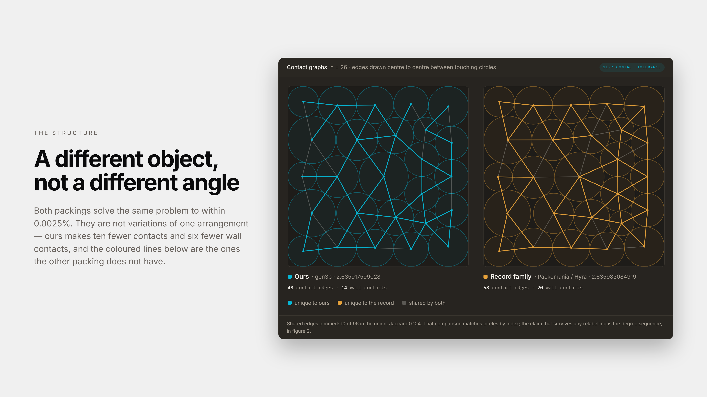
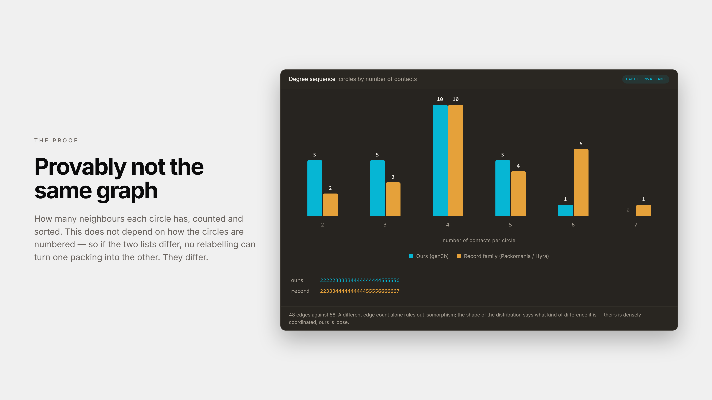

# Extrapolation Under an Exact Verifier: n = 26 Circle Packing

A frozen language model with an external memory loop produced a 26-circle packing that is **provably non-isomorphic** to every published solution for which we could obtain coordinates, including AlphaEvolve's. This repository contains the coordinates, exact verifier, full reasoning trace, and archive of all 91 attempts.

**Write-up:** https://blankline.org/research/extrapolation-under-an-exact-verifier



Same problem, nearly identical objective value, different structure. Our configuration has **48 contacts**; the record family has **58**.

## Check it in ten seconds

Requires Node 18+. No dependencies or installation step.

```sh
git clone https://github.com/blankline-org/extrapolation-n26
cd extrapolation-n26
node verify.mjs
```

```text
sum of radii    2.635917599028
max violation   2.776e-17   (overlap 1-13)
valid @ 1e-9    yes
```

The maximum measured constraint violation is **2.78e-17**. The verifier is approximately forty lines, and the candidate program did not have access to it during generation.

```sh
node contact-graph.mjs   # the non-isomorphism proof
node archive-stats.mjs   # statistics from the 91 attempts
node verify.mjs pack26-discovery/alphaevolve-n26.json   # or any other solution file
```

## The proof



Both packings have ten degree-4 circles. The difference appears in the tails: our configuration has more low-degree circles, while the record family has more high-degree circles.

A degree sequence is invariant under relabeling. **Two graphs with different degree sequences cannot be isomorphic.** This makes the structural distinction a proof rather than an observation. `contact-graph.mjs` recomputes the degree sequences directly from the published coordinates.

|                         | Contacts | Wall contacts | Degree sequence              |
| ----------------------- | -------: | ------------: | ---------------------------- |
| **This work**           |   **48** |        **14** | `22222333334444444444555556` |
| AlphaEvolve             |       29 |            15 | `11112222222222222233333344` |
| Packomania (Haowei Lin) |       58 |            20 | `22333444444444455556666667` |
| Hyra full-precision     |       58 |            20 | `22333444444444455556666667` |

AlphaEvolve's published construction is not snapped to exact contact, so its inferred edge count depends on the contact tolerance: 29 at 1e-7, 38 at 1e-6, and 46 at 1e-5. The non-isomorphism conclusion remains unchanged at each tolerance we tested. The corresponding contact graph is therefore less stable under tolerance changes than the record family's, which remains at 58 contacts.

## What this is not

**Not a record.** Six published results exceed **2.635917599028**, including a simulated-annealing heuristic with no model in the loop (**2.6359372**) and an independent result reported in July 2025 (**2.63592717**). The published record is **2.635983084919**.

**Not the strictest verification standard in the field.** AlphaEvolve validates at `atol = 0`. We report our measured maximum violation of **2.78e-17** rather than describing it as the strictest tolerance standard.

**Not a new research category.** Verified LLM discovery is an established area, including FunSearch's 2023 *Nature* publication. Test-time learning with external memory over a frozen model is also an established research direction with published systems and benchmarks.

Our contribution is narrower: a timestamped, self-reported retrieval attempt that ends in a reported retrieval failure, followed by a configuration whose structural distinction from the published record family is formally verifiable, together with the archive of attempts that produced it.

## Provenance

**Three components contributed to the published number, and only the first involved a model.**

| Stage                                                     |          Value |     Gain | Model? |
| --------------------------------------------------------- | -------------: | -------: | ------ |
| Memory loop, best of 91 attempts                          | 2.635907462261 |        — | Yes    |
| + LP radii and relocation (`scripts/relocate.mjs`)        | 2.635912195016 | +4.73e-6 | No     |
| + Seed and parent sweep (`pack26-discovery/gen-next.mjs`) | 2.635917599028 | +5.40e-6 | No     |

Stage 2 is a **human algorithmic contribution**, not a contribution of the memory loop. With the circle centers fixed, maximizing the sum of radii is a linear program. The model identified this opportunity repeatedly but never implemented it. Instead, every program it generated used a greedy grow-to-fit procedure that converges to a fixed point below the LP optimum. The formulation and reasoning are documented in the header of [`scripts/lp-radii.mjs`](scripts/lp-radii.mjs).

The margins over AlphaEvolve and Friedman 2012 are already present in the memory loop's best result and therefore survive without either post-processing stage. **The margin over FICO Xpress does not.** Reaching the published value requires both model-free stages, including the human-authored LP contribution.

## What is not here

**The memory loop itself.** `src/evolve.mjs` is an internal [Dropstone](https://dropstone.io) research system and is not released. It is not shipped, available to customers, or integrated into a production model. If it reaches production, it will operate within Dropstone and will first have to pass the misuse, memory-integrity, and tenant-isolation evaluations described in §7.2 of the write-up.

What is published here is the loop's complete output record: all 91 attempts, including the model's analysis, verified score, failure reason, and timestamp. Both post-processing stages are also included in full because they contain no model calls.

**You can audit the loop's recorded behavior and independently verify the numerical claims derived from its outputs. You cannot rerun the loop itself.**

## Layout

| Path                                           | Contents                                                                       |
| ---------------------------------------------- | ------------------------------------------------------------------------------ |
| `pack26-discovery/gen3b-best.json`             | Final configuration: 26 `(x, y, r)` triples                                    |
| `pack26-discovery/alphaevolve-n26.json`        | AlphaEvolve's construction, extracted and re-verified                          |
| `pack26-discovery/packomania26.json`           | Packomania record coordinates                                                  |
| `pack26-discovery/hyra-n26.json`               | Full-precision Hyra coordinates                                                |
| `pack26-discovery/incumbent.json`              | LP-verified local optimum from which the search moved to a different structure |
| `pack26-discovery/`                            | Full lineage from the initial seed through gen3b, with parents and scores      |
| `src/problems.mjs`                             | Verifier used by the search                                                    |
| `scripts/`                                     | Human-authored, model-free phase 2                                             |
| `results/reasoning-live.heavy.log`             | 214,223 bytes of verbatim reasoning, including line 3018                       |
| `results/archive-circle-packing-26.heavy.json` | 91 attempts with analysis, scores, failure reasons, and timestamps             |
| `results/report-convention.md`                 | Memory-on/memory-off convention control                                        |
| `results/report-independent.md`                | Memory-on/memory-off independent-task control, including the null result       |

## Open experiments

Several experiments remain outstanding and are important for interpreting the central claim.

* **Matched-budget memory-free restarts.** `pack26-discovery/structural-search.mjs` contains no model in the loop and accepts `--seed` and `--seconds`. Running matched-budget restarts would test how often a memory-free search reaches **2.63586276** and how often it produces the degree sequence `22222333334444444444555556`.

* **Shuffled-memory control.** Providing records from an unrelated problem would test whether any observed improvement comes from useful memory content or simply from additional context in the prompt.

* **Comparison against AlphaEvolve.** AlphaEvolve's coordinates are included in `pack26-discovery/alphaevolve-n26.json`, allowing the structural comparison to be reproduced directly.

These experiments are described in §9.3 of the write-up. The matched-budget restart experiment requires neither additional model calls nor access to our internal system.

## Scope

This is an existence result based on **one problem and one run**. It does not establish that external memory generally produces extrapolation, improves search efficiency, or reduces failure rates.

The narrower claim is that, under an exact verifier, this memory-conditioned search produced a configuration with a contact graph provably different from the published solutions for which we obtained coordinates, and that the recorded search history and downstream verification artifacts are available for independent inspection.

## License

MIT. See [`LICENSE`](LICENSE).

The coordinates and archived run data concern a public mathematical benchmark and are released under the same terms.

Built by Blankline, the team behind [Dropstone](https://dropstone.io).

The model used was Dropstone Heavy 1.7 (Kimi 3), served from our own endpoint with its parameters frozen. We did not train the model; we built the external memory loop around it.
